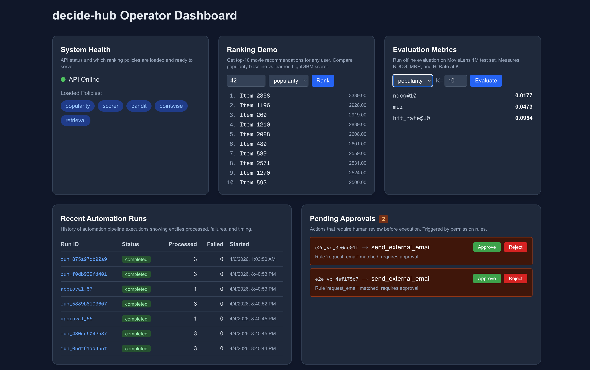
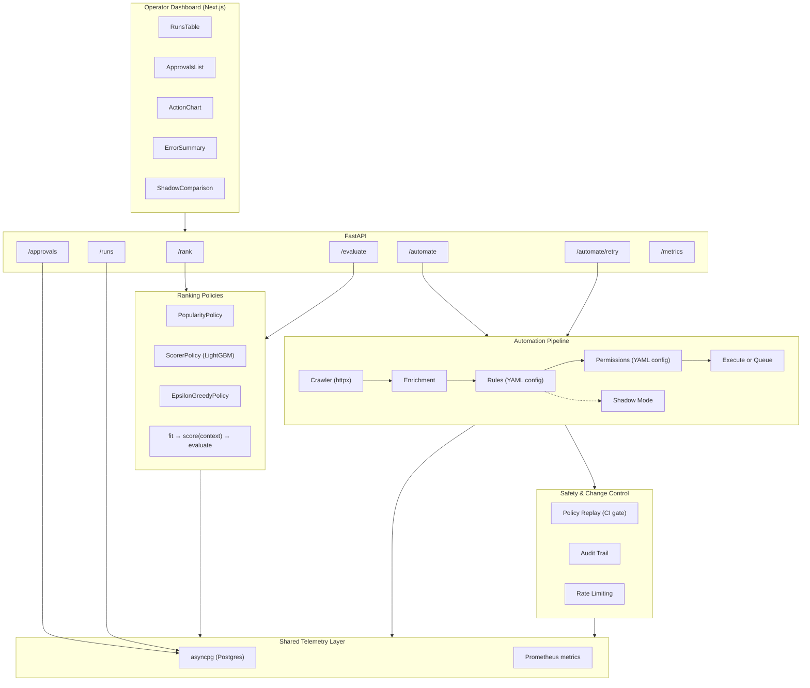

# decide-hub

Decision-policy engine for ranking, counterfactual evaluation, and safe operational automation.

A full-stack decision system: Python ML backend ranks items and evaluates policies offline, an automation pipeline processes entities with configurable rules and safety guardrails, and a Next.js dashboard gives operators visibility into runs, approvals, and failures.

**Stack:** Python · FastAPI · Postgres · LightGBM · asyncpg · Next.js · React · Tailwind · Playwright · Docker · GitHub Actions



## Architecture



## Quick Start

```bash
# Start Postgres
docker compose up -d postgres

# Install and run
make install
make eval    # Run offline evaluation (downloads MovieLens 1M on first run)
make serve   # Start API on :8000
make test    # Run test suite
```

## Ranking Benchmarks (MovieLens 1M)

| Policy | NDCG@10 | MRR | HitRate@10 |
|--------|---------|-----|------------|
| Popularity | 0.0177 | 0.0473 | 0.0954 |
| LightGBM LambdaRank | 0.0017 | 0.0119 | 0.0080 |
| Epsilon-Greedy Bandit (e=0.1) | 0.0001 | 0.0078 | 0.0003 |

Scorer and bandit evaluated on a 500-user test split. The bandit warm-starts from normalized average ratings (no collaborative filtering features) — offline metrics reflect the quality of the warm-start, not the bandit's online learning ability. See [DECISIONS.md](DECISIONS.md) #3 and #15.

## Bandit Comparison (Simulated Online)

| Policy | Cumulative Reward (10K rounds) |
|--------|-------------------------------|
| Static best-arm | 3755 |
| Epsilon-greedy (e=0.1) | 8424 |

The static policy picks a single best arm estimated from a warmup phase
and never adapts. The bandit explores with 10% probability and exploits
its learned estimates otherwise. See [DECISIONS.md](DECISIONS.md) #15 for
why the bandit uses in-memory arm state and what the evaluation measures.

## Counterfactual Evaluation (Synthetic Data)

| Estimator | Value |
|-----------|-------|
| Naive average | 0.8120 |
| IPS (target temp=0.5) | 0.8879 |
| Clipped IPS (M=10) | 0.8879 |

Evaluated on synthetic logged-policy data where propensities are known
by construction. See [DECISIONS.md](DECISIONS.md) #1 for methodology.

## Retrieval Benchmarks (Synthetic Corpus)

| Policy | NDCG@10 | MRR | HitRate@10 |
|--------|---------|-----|------------|
| TF-IDF Retrieval | 0.9317 | 1.0000 | 1.0000 |

30-document corpus with 12 queries and graded relevance judgments (3/2/1).
NDCG uses graded gains (2^grade - 1); MRR and HitRate are binary. Same
BasePolicy interface, same evaluation metrics, same CI gates — different
decision domain. See [DECISIONS.md](DECISIONS.md) #16.

## Automation Pipeline

```
Source API -> Crawler -> Enrichment -> Rules -> Permissions -> Execute/Queue -> Log
```

- **Rules:** YAML-configured routing (operator-editable, validated at load)
- **Permissions:** Separate safety policy (allow/block/approval_required)
- **Dry run:** `POST /automate {"source_url": "...", "dry_run": true}` previews per-entity results
- **Failure handling:** Per-entity error isolation, `failed_entities` table with configurable retry
- **Idempotency:** DB unique constraint prevents duplicate processing on retry
- **Shadow mode:** Run candidate rules alongside production, compare distributions (TVD + per-action deltas)
- **Policy replay:** Frozen-context regression testing — CI fails if action distribution drifts >15%
- **Audit trail:** Every permission decision logged with actor, action type, and reason
- **Approve/reject:** Human-in-the-loop for high-risk actions via `/approvals` API + dashboard buttons
- **Retry + dead-letter:** Configurable per-error retry policy, entities exceeding max retries move to dead-letter
- **Rate limiting:** Sliding-window rate limit (5 req/60s), entity cap (100/run), backpressure detection

## Operator Dashboard

Next.js + React + Tailwind dashboard at `:3000`:
- Recent automation runs with status
- Pending approvals with approve/reject buttons
- Action distribution chart
- Failed entities grouped by error type
- Shadow mode comparison (production vs candidate rule distributions)

## Development

```bash
make install   # Create venv and install deps
make test      # Python tests (excludes E2E)
make e2e       # Playwright E2E (requires Postgres + API + Next.js)
make eval      # Run offline ranking evaluation
make serve     # Start FastAPI dev server
make db-reset  # Reset Postgres (destroys data)
```

## Docker

```bash
docker compose up --build -d   # Full stack: Postgres (5432) + API (8000) + Dashboard (3000)
docker compose down             # Stop all
```

## Roadmap

This repo is designed to grow from static ranking to contextual bandits to full policy learning:

- Collaborative filtering features for scorer (user-item interaction matrix)
- ~~Contextual bandits (exploration/exploitation with safety bounds)~~ (shipped in Phase 2 — epsilon-greedy with online simulation)
- ~~Policy replay + change control~~ (shipped in Phase 1)
- KPI/experimentation layer (A/B test simulation, confidence intervals)
- Action executor (trigger real side-effects for approved actions)
