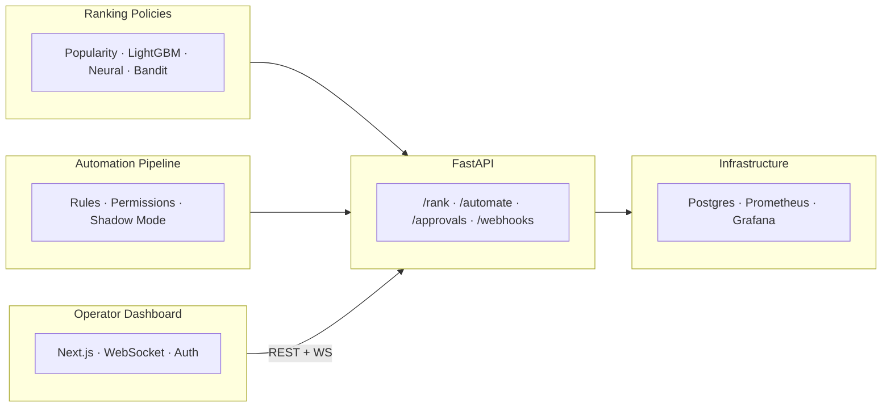

# decide-hub

Decision-policy engine for ranking, counterfactual evaluation, and safe operational automation.

A full-stack decision system: Python ML backend ranks items and evaluates policies offline, an automation pipeline processes entities with configurable rules and safety guardrails, and a Next.js dashboard gives operators visibility into runs, approvals, and failures.

**Stack:** Python · FastAPI · Postgres · LightGBM · PyTorch · SHAP · asyncpg · Next.js · React · Tailwind · Playwright · Docker · Grafana · Prometheus · GitHub Actions

**Why this project?** Most ML portfolio projects demonstrate model training. This one demonstrates what happens *after* training: how do you deploy a policy safely, evaluate it honestly, control what it can do, and detect when it drifts? The ranking module shows offline evaluation with counterfactual methods. The automation module shows guarded execution with human-in-the-loop approvals. The dashboard shows operational visibility. Together they demonstrate the full lifecycle of a decision system, not just the modeling step.


## Architecture



The `BasePolicy` interface supports additional policy types (offline RL, constrained optimization) without changes to the evaluation or serving layers. 27 design decisions are documented in [DECISIONS.md](DECISIONS.md).

## Key Findings

- LightGBM scorer underperforms popularity baseline on raw features — expected without collaborative filtering signals ([#3](DECISIONS.md))
- Adding CF embeddings (SVD, dim=8) produces 7.6x NDCG lift — but only for warm-start users ([#18](DECISIONS.md))
- IPS correctly estimates higher policy value for the greedy target policy vs exploratory logging policy ([#6](DECISIONS.md))
- Epsilon-greedy bandit achieves 2.2x cumulative reward over static best-arm policy in 10K simulated rounds ([#15](DECISIONS.md))
- Pointwise regressor outperforms pairwise LambdaRank on raw features — objective matters more than model capacity ([#23](DECISIONS.md))
- Doubly Robust estimator reduces variance 21% vs IPS by combining propensity weighting with a reward model ([#25](DECISIONS.md))

## Automation Pipeline

```
Source API -> Crawler -> Enrichment -> Rules -> Permissions -> Execute/Queue -> Log
```

- **Rules:** YAML-configured routing (operator-editable, validated at load)
- **Permissions:** Separate safety policy (allow/block/approval_required)
- **Shadow mode:** Run candidate rules alongside production, compare distributions (TVD + per-action deltas)
- **Policy replay:** Frozen-context regression testing — CI fails if action distribution drifts >15%
- **Audit trail:** Every permission decision logged with actor, action type, and reason
- **Approve/reject:** Human-in-the-loop for high-risk actions via `/approvals` API + dashboard buttons
- **Retry + dead-letter:** Configurable per-error retry policy, entities exceeding max retries move to dead-letter
- **Rate limiting:** Sliding-window rate limit (5 req/60s), entity cap (100/run), backpressure detection
- **Idempotency:** DB unique constraint prevents duplicate processing on retry

## Operator Dashboard

Multi-page Next.js + React + Tailwind dashboard at `:3000`:

- **`/`** — Overview: runs, approvals, action chart, errors, shadow comparison, anomaly indicator
- **`/runs/:id`** — Run detail: entity-level outcomes + audit trail
- **`/approvals`** — Dedicated approval queue with approve/reject buttons
- **`/policies`** — Policy comparison view (cached evaluation results)
- **`/login`** — JWT authentication (operator/viewer roles)
- **WebSocket live updates** — RunsTable streams entity_processed events in real time
- **Role-based UI** — Approve/reject buttons visible only to operators
- **Anomaly indicator** — Green/red status from `/anomalies` endpoint (3 SD z-score drift detection)


## Evaluation Results

**Ranking (MovieLens 1M):** 7 policies evaluated. Best NDCG@10: 0.0177 (popularity), 0.0129 (LightGBM + CF embeddings). Neural two-tower with CF embeddings reaches 0.0111. [Full comparison](docs/benchmarks.md).

| Policy | NDCG@10 | MRR | HitRate@10 |
|--------|---------|-----|------------|
| Popularity | 0.0177 | 0.0473 | 0.0954 |
| Pointwise (LGBMRegressor) | 0.0073 | 0.0216 | 0.0349 |
| Pairwise LambdaRank | 0.0017 | 0.0119 | 0.0080 |
| Pairwise + CF Embeddings | 0.0129 | 0.0340 | 0.0650 |
| Neural Two-Tower (BPR) | 0.0082 | 0.0239 | 0.0474 |
| Neural + CF Embeddings | 0.0111 | 0.0330 | 0.0690 |
| Epsilon-Greedy Bandit | 0.0001 | 0.0078 | 0.0003 |

**Counterfactual:** IPS-corrected policy value 0.8879 vs naive 0.8120 on synthetic logged data. Doubly Robust reduces variance 21% vs IPS. See [DECISIONS.md](DECISIONS.md) #1, #25.

**Bandit:** Epsilon-greedy (e=0.1) achieves 8424 cumulative reward vs 3755 for static best-arm over 10K simulated rounds. See [DECISIONS.md](DECISIONS.md) #15.

**Retrieval:** TF-IDF on 30-doc corpus, NDCG@10 = 0.93. Same `BasePolicy` interface and evaluation harness as ranking. See [DECISIONS.md](DECISIONS.md) #16.

**Experimentation:** Bootstrap confidence intervals with segment-wise breakdown. No p-values — CIs communicate significance while preserving effect magnitude. See [DECISIONS.md](DECISIONS.md) #17.

## Quick Start

```bash
# Start Postgres
docker compose up -d postgres

# Install and run
make install
make eval    # Run offline evaluation (downloads MovieLens 1M on first run)
make serve   # Start API on :8000
make test    # Run test suite
```

## Docker

```bash
docker compose up --build -d   # Full stack: Postgres (5432) + API (8000) + Dashboard (3000) + Grafana (3001) + Prometheus (9090)
docker compose down             # Stop all
```

API documentation available at `localhost:8000/docs` (Swagger UI).

## Development

```bash
make install   # Create venv and install deps
make test      # Python tests (excludes E2E)
make e2e       # Playwright E2E (requires Postgres + API + Next.js)
make eval      # Run offline ranking evaluation
make serve     # Start FastAPI dev server
make db-reset  # Reset Postgres (destroys data)
```

See [docs/development.md](docs/development.md) for analysis scripts, API examples, and curl commands.
