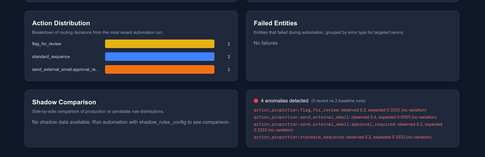
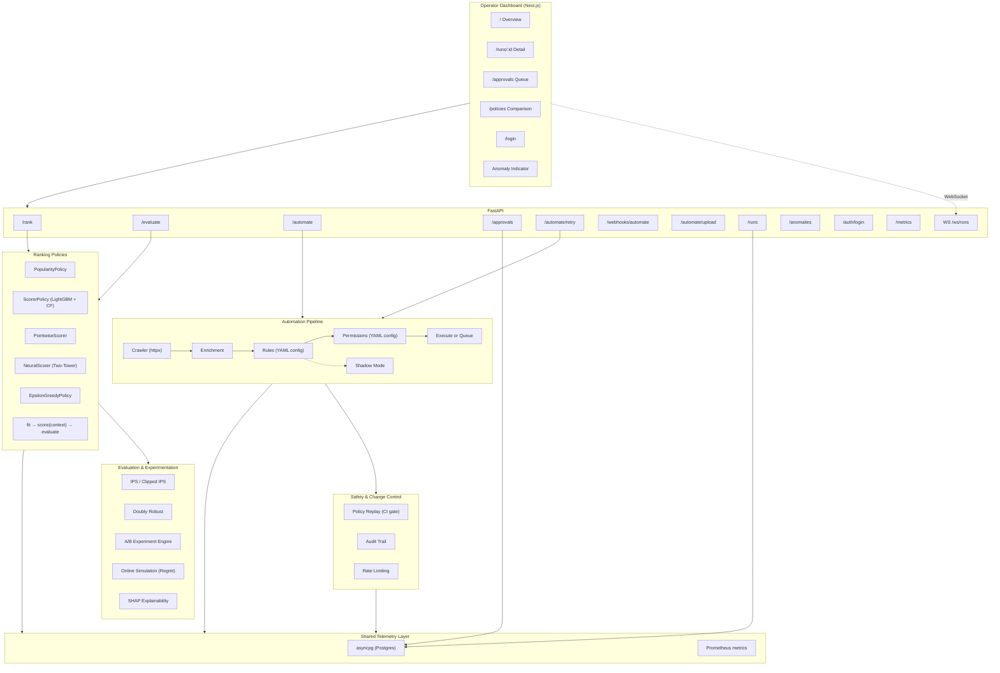
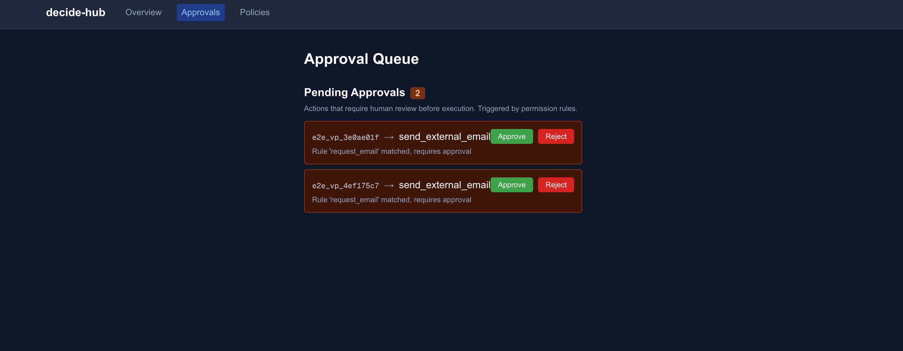
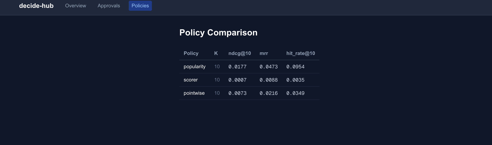

# decide-hub

Decision-policy engine for ranking, counterfactual evaluation, and safe operational automation.

A full-stack decision system: Python ML backend ranks items and evaluates policies offline, an automation pipeline processes entities with configurable rules and safety guardrails, and a Next.js dashboard gives operators visibility into runs, approvals, and failures.

**Stack:** Python · FastAPI · Postgres · LightGBM · PyTorch · SHAP · asyncpg · Next.js · React · Tailwind · Playwright · Docker · Grafana · Prometheus · GitHub Actions




## Architecture



## Quick Start

```bash
# Start Postgres
docker compose up -d postgres

# Install and run
make install
make eval    # Run offline evaluation (downloads MovieLens 1M on first run)
make serve   # Start API on :8000
make test    # Run test suite
```

## Ranking Benchmarks (MovieLens 1M)

| Policy | NDCG@10 | MRR | HitRate@10 |
|--------|---------|-----|------------|
| Popularity | 0.0177 | 0.0473 | 0.0954 |
| Pointwise (LGBMRegressor) | 0.0073 | 0.0216 | 0.0349 |
| Pairwise LambdaRank | 0.0017 | 0.0119 | 0.0080 |
| Pairwise + CF Embeddings (dim=8) | 0.0129 | 0.0340 | 0.0650 |
| Neural Two-Tower (BPR) | 0.0082 | 0.0239 | 0.0474 |
| Neural + CF Embeddings | 0.0111 | 0.0330 | 0.0690 |
| Epsilon-Greedy Bandit (e=0.1) | 0.0001 | 0.0078 | 0.0003 |

CF embeddings computed on training split only (no test leakage). Pointwise
regressor outperforms pairwise LambdaRank on raw features (#23) but the
pairwise scorer with CF embeddings wins overall. Neural two-tower with
CF embeddings approaches the LightGBM+CF result — competitive on this
dataset despite shallow MLPs being less suited to tabular features (#24).
See [DECISIONS.md](DECISIONS.md) #18, #23, #24.

## Bandit Comparison (Simulated Online)

| Policy | Cumulative Reward (10K rounds) |
|--------|-------------------------------|
| Static best-arm | 3755 |
| Epsilon-greedy (e=0.1) | 8424 |

The static policy picks a single best arm estimated from a warmup phase
and never adapts. The bandit explores with 10% probability and exploits
its learned estimates otherwise. See [DECISIONS.md](DECISIONS.md) #15 for
why the bandit uses in-memory arm state and what the evaluation measures.

## Counterfactual Evaluation (Synthetic Data)

| Estimator | Value |
|-----------|-------|
| Naive average | 0.8120 |
| IPS (target temp=0.5) | 0.8879 |
| Clipped IPS (M=10) | 0.8879 |

Evaluated on synthetic logged-policy data where propensities are known
by construction. Doubly Robust estimator reduces variance by combining IPS
with a reward model. See [DECISIONS.md](DECISIONS.md) #1, #25.

## A/B Experimentation (Synthetic Data)

Bootstrap confidence intervals with no p-values — CIs and effect sizes
communicate significance while preserving effect magnitude and uncertainty.
Segment-wise breakdown and minimum detectable effect calculator included.

```bash
python scripts/run_experiment.py    # Run control vs treatment comparison
```

See [DECISIONS.md](DECISIONS.md) #17 for the CIs-over-p-values rationale.

## Retrieval Benchmarks (Synthetic Corpus)

| Policy | NDCG@10 | MRR | HitRate@10 |
|--------|---------|-----|------------|
| TF-IDF Retrieval | 0.9317 | 1.0000 | 1.0000 |

30-document corpus with 12 queries and graded relevance judgments (3/2/1).
NDCG uses graded gains (2^grade - 1); MRR and HitRate are binary. Same
BasePolicy interface, same evaluation metrics, same CI gates — different
decision domain. See [DECISIONS.md](DECISIONS.md) #16.

## Automation Pipeline

```
Source API -> Crawler -> Enrichment -> Rules -> Permissions -> Execute/Queue -> Log
```

- **Rules:** YAML-configured routing (operator-editable, validated at load)
- **Permissions:** Separate safety policy (allow/block/approval_required)
- **Dry run:** `POST /automate {"source_url": "...", "dry_run": true}` previews per-entity results
- **Failure handling:** Per-entity error isolation, `failed_entities` table with configurable retry
- **Idempotency:** DB unique constraint prevents duplicate processing on retry
- **Shadow mode:** Run candidate rules alongside production, compare distributions (TVD + per-action deltas)
- **Policy replay:** Frozen-context regression testing — CI fails if action distribution drifts >15%
- **Audit trail:** Every permission decision logged with actor, action type, and reason
- **Approve/reject:** Human-in-the-loop for high-risk actions via `/approvals` API + dashboard buttons
- **Retry + dead-letter:** Configurable per-error retry policy, entities exceeding max retries move to dead-letter
- **Rate limiting:** Sliding-window rate limit (5 req/60s), entity cap (100/run), backpressure detection

## Operator Dashboard

Multi-page Next.js + React + Tailwind dashboard at `:3000`:

- **`/`** — Overview: runs, approvals, action chart, errors, shadow comparison, anomaly indicator
- **`/runs/:id`** — Run detail: entity-level outcomes + audit trail
- **`/approvals`** — Dedicated approval queue with approve/reject buttons
- **`/policies`** — Policy comparison view (cached evaluation results)
- **`/login`** — JWT authentication (operator/viewer roles)
- **WebSocket live updates** — RunsTable streams entity_processed events in real time
- **Role-based UI** — Approve/reject buttons visible only to operators
- **Anomaly indicator** — Green/red status from `/anomalies` endpoint (3 SD z-score drift detection)




## Authentication

JWT HS256 with two roles:
- **`operator`**: read + write (automate, approve/reject, retry, webhook, upload)
- **`viewer`**: read-only (runs, approvals, metrics)
- `/health` and `/metrics` are open (no auth required)

Demo accounts: `admin/admin` (operator), `viewer1/viewer1` (viewer). See [DECISIONS.md](DECISIONS.md) #21.

## Development

```bash
make install   # Create venv and install deps
make test      # Python tests (excludes E2E)
make e2e       # Playwright E2E (requires Postgres + API + Next.js)
make eval      # Run offline ranking evaluation
make serve     # Start FastAPI dev server
make db-reset  # Reset Postgres (destroys data)
```

**Analysis scripts:**

```bash
python scripts/run_experiment.py          # A/B experiment with bootstrap CIs
python scripts/run_bandit_comparison.py   # Bandit vs static cumulative reward
python scripts/run_regret_comparison.py   # Multi-policy regret curves
python scripts/run_cf_comparison.py       # Scorer with/without CF embeddings
python scripts/run_pareto_analysis.py     # Constrained optimization tradeoffs
python scripts/compare_estimators.py      # IPS vs Doubly Robust variance
python scripts/generate_shap_plot.py      # SHAP feature importance plot
```

**Entity intake (requires auth token):**

```bash
# CSV upload
curl -X POST http://localhost:8000/automate/upload \
  -H "Authorization: Bearer $TOKEN" \
  -F "file=@tests/fixtures/sample_entities.csv" \
  -F "dry_run=true"

# Webhook (async — returns 202, poll /runs/{run_id})
curl -X POST http://localhost:8000/webhooks/automate \
  -H "Authorization: Bearer $TOKEN" \
  -H "Content-Type: application/json" \
  -d '{"entities": [{"entity_id": "test", "company": "Co", "role": "CTO", "source": "organic", "signup_date": "2026-04-01"}]}'
```

See `tests/fixtures/sample_entities.csv` for the expected CSV format.

## Docker

```bash
docker compose up --build -d   # Full stack: Postgres (5432) + API (8000) + Dashboard (3000) + Grafana (3001) + Prometheus (9090)
docker compose down             # Stop all
```

## Roadmap

Completed:
- ~~Policy replay + change control~~ (Phase 1 — TVD-based CI gate)
- ~~Shadow mode + audit trail + approve/reject~~ (Phase 1 — safe deployment pipeline)
- ~~Contextual bandits~~ (Phase 2 — epsilon-greedy with online simulation)
- ~~Retrieval/search mode~~ (Phase 2 — TF-IDF, same BasePolicy interface)
- ~~A/B experimentation layer~~ (Phase 2 — bootstrap CIs, KPI transforms)
- ~~CF embeddings for scorer~~ (Phase 2 — SVD, 7.6x NDCG lift)
- ~~Anomaly detection~~ (Phase 2 — z-score drift, rate spikes)
- ~~Multi-page dashboard + WebSocket + auth~~ (Phase 3)
- ~~Webhook + CSV upload~~ (Phase 3 — async execution, entity intake)
- ~~Model depth~~ (Phase 4 — pointwise/neural/pLTV, SHAP, DR, constrained optimization, Grafana)

Future:
- Action executor (trigger real side-effects for approved actions)
- Offline RL (batch-constrained policy learning)
- Multi-objective optimization (Pareto-optimal policy selection)
