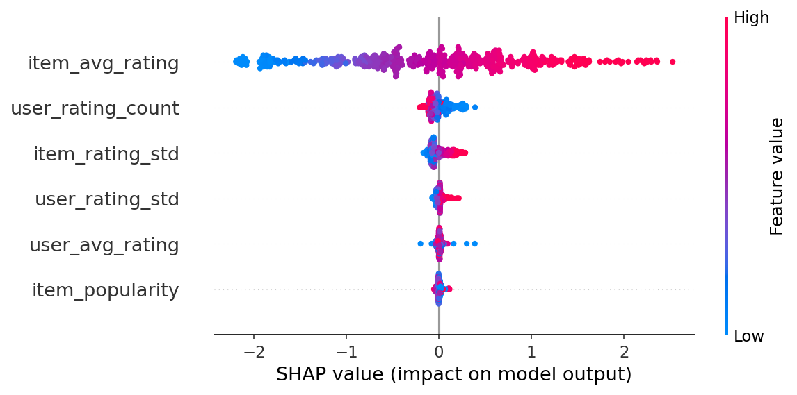

# Benchmark Results

## Ranking (MovieLens 1M)

| Policy | NDCG@10 | MRR | HitRate@10 |
|--------|---------|-----|------------|
| Popularity | 0.0177 | 0.0473 | 0.0954 |
| Pointwise (LGBMRegressor) | 0.0073 | 0.0216 | 0.0349 |
| Pairwise LambdaRank | 0.0017 | 0.0119 | 0.0080 |
| Pairwise + CF Embeddings (dim=8) | 0.0129 | 0.0340 | 0.0650 |
| Neural Two-Tower (BPR) | 0.0082 | 0.0239 | 0.0474 |
| Neural + CF Embeddings | 0.0111 | 0.0330 | 0.0690 |
| Epsilon-Greedy Bandit (e=0.1) | 0.0001 | 0.0078 | 0.0003 |

CF embeddings computed on training split only (no test leakage). Pointwise
regressor outperforms pairwise LambdaRank on raw features (#23) but the
pairwise scorer with CF embeddings wins overall. Neural two-tower with
CF embeddings approaches the LightGBM+CF result — competitive on this
dataset despite shallow MLPs being less suited to tabular features (#24).
See [DECISIONS.md](../DECISIONS.md) #18, #23, #24.

## Bandit Comparison (Simulated Online)

| Policy | Cumulative Reward (10K rounds) |
|--------|-------------------------------|
| Static best-arm | 3755 |
| Epsilon-greedy (e=0.1) | 8424 |

The static policy picks a single best arm estimated from a warmup phase
and never adapts. The bandit explores with 10% probability and exploits
its learned estimates otherwise. See [DECISIONS.md](../DECISIONS.md) #15.

## Counterfactual Evaluation (Synthetic Data)

| Estimator | Value |
|-----------|-------|
| Naive average | 0.8120 |
| IPS (target temp=0.5) | 0.8879 |
| Clipped IPS (M=10) | 0.8879 |
| Doubly Robust | lower variance (21% reduction vs IPS) |

Evaluated on synthetic logged-policy data where propensities are known
by construction. See [DECISIONS.md](../DECISIONS.md) #1, #25.

## Retrieval (Synthetic Corpus)

| Policy | NDCG@10 | MRR | HitRate@10 |
|--------|---------|-----|------------|
| TF-IDF Retrieval | 0.9317 | 1.0000 | 1.0000 |

30-document corpus with 12 queries and graded relevance judgments (3/2/1).
See [DECISIONS.md](../DECISIONS.md) #16.

## SHAP Feature Importance

Top features by mean |SHAP value|:
1. `item_avg_rating` (0.8336)
2. `user_rating_count` (0.0786)
3. `item_rating_std` (0.0762)
